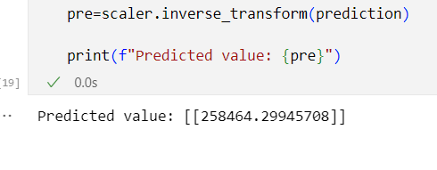

# Implementation-of-Linear-Regression-Using-Gradient-Descent

## AIM:
To write a program to predict the profit of a city using the linear regression model with gradient descent.

## Equipments Required:
1. Hardware – PCs
2. Anaconda – Python 3.7 Installation / Jupyter notebook

## Algorithm
```
1.Import the standard libraries in python required for finding Gradient Design.
2.Read the dataset file and check any null value using .isnull() method.
3.Declare the default variables with respective values for linear regression.
4.Calculate the loss using Mean Square Error.
5.Predict the value of y.
6.Plot the graph respect to hours and scores using .scatterplot() method for Linear Regression.
7.Plot the graph respect to loss and iterations using .plot() method for Gradient Descent.
```
## Program:
```
/*
Program to implement the linear regression using gradient descent.
Developed by: T Kirthi Niharika
RegisterNumber:  212221040084
*/
import numpy as np

import pandas as pd

from sklearn.preprocessing import StandardScaler

def linear_regression(X1, y, learning_rate=0.01, num_iters=1000):

# Add a column of ones to X for the intercept term 
    X = np.c_[np.ones(len(X1)), X1]
# Initialize theta with zeros theta = np.zeros(x.shape[1]).reshape(-1,1)
    theta=np.zeros(X.shape[1]).reshape(-1,1)
# Perform gradient descent for
    for _ in range(num_iters): # Calculate predictions
        predictions = (X).dot(theta).reshape(-1,1)
        errors = (predictions - y).reshape(-1, 1)

# Calculate errors
        errors = (predictions - y).reshape(-1,1)
        theta -= learning_rate * (1 / len(X1))*X.T.dot(errors)
        return theta
data = pd.read_csv('50_Startups.csv',header=None)
X = (data.iloc[1:, :-2].values)

X1=X.astype(float)

scaler = StandardScaler()
y = (data.iloc[1:,-1].values).reshape(-1,1)
X1_Scaled = scaler.fit_transform(X1)
Y1_Scaled = scaler.fit_transform(y)
theta = linear_regression(X1_Scaled, Y1_Scaled)
new_data = np.array([165349.2,136897.8,471784.1]).reshape(-1,1)


new_Scaled = scaler.fit_transform(new_data) 
prediction =np.dot (np.append(1, new_Scaled), theta)


prediction=prediction.reshape(-1,1)

```

## Output:


## Result:
Thus the program to implement the linear regression using gradient descent is written and verified using python programming.
